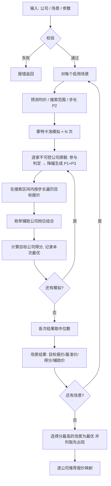

# 报价测算 — 计算过程说明

本文档详细描述本插件的完整计算逻辑。算法逐行移植自 TenderOptimizer Python 版，
以实现代码为唯一事实源；文末列出与 Python 版的差异清单。

## 一、系统概述

基于市场降价假设，通过**蒙特卡洛模拟**（默认 100 次）构造竞争环境，为目标公司
寻找得分最高的二轮报价方案，同时给出辅助公司的配合报价。

- 计算引擎位于 Rust 侧（`plugins/tender-optimizer/backend/engine.rs`），
  数据由前端传入，纯函数无状态
- 结果确定可复现：每次模拟使用固定种子 `seed + sim`（seed = 42）
- 汇总方式：各次模拟结果取**中位数**作为推荐值（比均值更稳健）

## 二、核心概念

### 2.1 公司类型

| 类型       | 代号 | 说明                                            |
| ---------- | ---- | ----------------------------------------------- |
| 目标公司   | T    | 要优化报价的公司，**有且仅有 1 家**（硬性要求） |
| 辅助公司   | A    | 可控制报价的公司，用于配合抬高/稳定均价         |
| 不可控公司 | U    | 竞争对手，报价按场景假设随机波动                |

### 2.2 公司行为模型（P3）

| 行为                | 降幅系数（默认）  | 说明                                       |
| ------------------- | ----------------- | ------------------------------------------ |
| aggressive 激进型   | 1.3               | 降价幅度比平均多 30%                       |
| normal 正常型       | 1.0               | 等于平均降幅（**未设置行为时也按正常型**） |
| conservative 保守型 | 0.5               | 比平均少降 50%                             |
| auto 自动           | 按报价/限价比判档 | 见下表                                     |

自动判档规则（`ratio = 首轮报价 / 含税限价`）：

| ratio 范围   | 系数                             |
| ------------ | -------------------------------- |
| > 0.98       | 激进型系数                       |
| (0.95, 0.98] | 正常型 + (激进型 − 正常型) × 0.5 |
| (0.90, 0.95] | 正常型系数                       |
| (0.85, 0.90] | 保守型 + (正常型 − 保守型) × 0.5 |
| ≤ 0.85       | 保守型系数                       |

### 2.3 测算场景

| 字段     | 说明                                                      |
| -------- | --------------------------------------------------------- |
| 降价方式 | `percent` 百分比 / `amount` 数值（万元）                  |
| 降价数值 | **负数**表示降价（如 -0.05 = 降 5%，-0.5 = 降 0.5 万）    |
| 参与率   | 0–1，每家不可控公司参与降价的概率                         |
| 标准差   | 降幅的高斯波动幅度；0 = 无显式波动（仍有隐式波动，见 P1） |
| 有效     | 仅启用的场景参与测算                                      |

### 2.4 评分参数（默认值）

| 参数                 | 默认值             | 含义                                              |
| -------------------- | ------------------ | ------------------------------------------------- |
| W1                   | -0.15              | 有效区间下限（低于 A1 的 15% 以内）               |
| W2                   | 0.10               | 有效区间上限（高于 A1 的 10% 以内）               |
| C                    | 0                  | 基准价浮动系数（**基准价 = 有效均价 × (1 − C)**） |
| n1                   | 1.0                | 报价 ≥ 基准价时的惩罚系数                         |
| n2                   | 0.5                | 报价 < 基准价时的惩罚系数                         |
| 激进/正常/保守型系数 | 1.3 / 1.0 / 0.5    | P3 行为系数                                       |
| 辅助公司最小价差     | 0.02 万            | 辅助公司报价间的最小差异                          |
| 模拟次数             | 100（范围 1–2000） | 蒙特卡洛模拟次数                                  |

> 注意：基准价公式为 `× (1 − C)`（以实现为准）。C = 0 时基准价 = 有效均价；
> C > 0 时基准价**低于**有效均价。旧版文档中 `× (1 + C)` 的写法与实现不符。

## 三、评分规则

### 3.1 去掉最高最低后的平均价 A1

根据投标人家数 M 决定「去高 / 去低」数量：

| M     | 去掉最高 | 去掉最低 |
| ----- | -------- | -------- |
| ≤ 5   | 0        | 0        |
| 6–10  | 1        | 1        |
| 11–20 | 2        | 1        |
| 21–30 | 2        | 2        |
| > 30  | 4        | 3        |

`A1 = 去掉最高最低后剩余报价的均值`

### 3.2 有效投标人判定

有效区间为**闭区间**：

```
[A1 × (1 + W1), A1 × (1 + W2)]
```

报价落在区间内的公司为有效投标人。若无人落区间，回退为
「按去高低规则剔除后剩余的投标人」。

### 3.3 基准价

```
基准价 = 有效投标人均价 × (1 − C)
```

### 3.4 价格得分（100 分制）

```
得分 = 100 − 100 × n × |报价 − 基准价| / 基准价     （下限 0）
n   = 报价 ≥ 基准价 ? n1 : n2
```

- `n1 > n2` 时，略低于基准价更有利（鼓励低价）
- `n1 = n2` 时，越接近基准价越优
- 偏离过大得分钳制为 0

## 四、三大特性

### P1：降幅标准差

每家不可控公司的实际降幅独立生成：

```
实际降幅 = 场景降幅 × 行为系数(P3) + gauss(0, σ)
σ = 标准差                        （标准差 > 0 时）
σ = |场景降幅| × 0.15（百分比方式）/ × 0.10（数值方式）   （标准差 = 0 时的隐式波动）
```

二轮报价：

```
百分比方式：新报价 = 首轮报价 × (1 + 实际降幅)
数值方式：  新报价 = 首轮报价 + 实际降幅
新报价 = max(0.01, 新报价) 后四舍五入到 4 位小数
```

每家公司在**每次模拟**中独立掷骰：先判定参与
（`随机数 < 参与率`，不参与则保持首轮报价），参与后才生成降幅。

**示例**（沿用原版文档）：不可控公司首轮 18.7 万，激进型（×1.3），
场景「百分比 -5% ±1.5%，参与率 80%」。假设参与：

```
基础降幅 = -5% × 1.3 = -6.5%
随机波动 = gauss(0, 1.5%) ≈ +0.8%
实际降幅 = -5.7%
新报价 = 18.7 × (1 - 5.7%) ≈ 17.65 万
```

### P2：自适应搜索范围

**预测市场均价**：不可控公司首轮报价按场景降幅直接折算后的均值
（不含随机波动与行为系数）。

**搜索范围**：

```
标准差 > 0：范围 = 标准差 × 2.5           （百分比方式再 × 目标首轮价）
标准差 = 0：范围 = |场景降幅| × 0.5       （百分比方式再 × 目标首轮价）
```

**搜索步长**（与标包价格成比例）：

```
步长 = 首轮报价 × 0.02%，钳制到 [0.001, 0.05] 万（10 元 ~ 500 元）
≥ 0.01 万取 2 位小数，否则取 3 位
```

| 标包价格 | 步长           | 搜索范围(约) | 遍历次数(约) |
| -------- | -------------- | ------------ | ------------ |
| 20 万    | 40 元          | ±0.75 万     | ~375         |
| 50 万    | 100 元         | ±1.88 万     | ~375         |
| 100 万   | 200 元         | ±3.75 万     | ~375         |
| 500 万   | 500 元（钳制） | ±18.75 万    | ~750         |

**搜索区间**：目标公司报价遍历范围 =

```
[0.88 × 首轮报价, 首轮报价] ∩ [预测均价 − 搜索范围, 预测均价 + 搜索范围]
```

交集为空时回退为 `[0.88 × 首轮报价, 首轮报价]`。

### P3：公司行为模型

见 2.2。作用点：仅影响**不可控公司**的模拟降幅（`场景降幅 × 行为系数`）。

## 五、完整计算流程



### 5.1 单次模拟内寻找最优报价

1. 按本次模拟出的不可控公司报价固定棋盘
2. 目标报价从搜索下限到上限按步长遍历
3. 辅助公司报价取限价附近固定档位组合：
   - 1 家辅助：`限价 × [99.5%, 99%, 98.5%, 98%]` 四选一
   - 2 家辅助：A 档四选一 × B 档（`限价 × [97.5%, 97%, 96.5%, 96%]`）四选一，
     且 `|A − B| < 最小价差` 的组合跳过
   - ≥ 3 家辅助：前 2 家按上述组合枚举，其余固定 `限价 × 98%`
4. 每个组合计算一次全体报价 → 基准价 → 目标公司得分
5. 得分严格更高的组合胜出（并列保留先出现者）

### 5.2 结果汇总

| 字段                       | 取值方式                       |
| -------------------------- | ------------------------------ |
| 目标报价                   | 各次模拟最优目标价的**中位数** |
| 基准价                     | 各次模拟基准价的**中位数**     |
| 得分                       | 各次模拟目标得分的**中位数**   |
| 辅助公司报价               | 得分最高的那次模拟的辅助组合   |
| 预测均价 / 搜索范围 / 步长 | 场景级常量（P2）               |

最优场景 = 各场景得分最高者（并列取先出现的场景）。

### 5.3 推荐报价映射

| 公司类型 | 推荐报价                           |
| -------- | ---------------------------------- |
| 目标 T   | 最优场景的目标报价                 |
| 辅助 A   | 最优场景辅助报价数组中对应序位的值 |
| 不可控 U | 无（不推荐）                       |

`变化 = 推荐报价 − 首轮报价`。

## 六、数值细节

- 所有模拟价格与结果统一四舍五入到 **4 位小数**（万元，即 0.1 元精度）
- 参与判定与高斯波动的随机调用顺序：逐公司「先判定、后波动」，
  与 Python 版一致，保证算法结构等价
- 模拟次数可调（1–2000），默认 100；次数越多中位数越稳健、耗时线性增长

## 七、与 Python 原版的差异

以下差异均为**有意为之或统计无影响**，逐条说明：

| #   | 差异                 | 说明                                                                                                                                                        |
| --- | -------------------- | ----------------------------------------------------------------------------------------------------------------------------------------------------------- |
| 1   | 随机数流不同         | Rust `StdRng(seed+sim)` 与 CPython MT19937 统计同分布但序列不同，同一输入的数值**不逐位一致**（分布、中位数性质一致）；种子策略（42+sim）与调用顺序保持一致 |
| 2   | round 语义           | Python `round()` 为半到偶（banker's rounding），Rust 为半远离零；仅理论边界值（如恰为 0.00005）受影响                                                       |
| 3   | arange 生成          | numpy `arange` 按乘法生成等差点列，Rust 按累加；长序列有 ~1e-13 量级漂移，对中位数无实际影响                                                                |
| 4   | 无不可控公司退化场景 | Python 预测均值为 nan；Rust 为 0 → 搜索区间回退 `[0.88r1, r1]` 全界（Rust 行为更稳健）                                                                      |
| 5   | 首轮报价 > 限价      | 与 Python 一致：导入时告警保留、测算照常进行（不做硬拦截）                                                                                                  |
| 6   | 导入无跨语句事务     | 框架 db 通道暂不支持事务，导入中途失败可能留下部分工作集数据（数据量小，风险可接受）                                                                        |
| 7   | 降幅展示文案         | 展示层 `-5.0%` 不带显式 `+` 号（Python 为 `+5.0%`），仅影响显示                                                                                             |

## 八、数据流架构

```
┌─────────────────────── 前端 (Vue) ───────────────────────┐
│ Calculator.vue                                           │
│  ├─ 工作集编辑 → kdb (tender_companies / tender_scenarios │
│  │                / tender_params，行内编辑即时落库)       │
│  ├─ 导入模板 → ipc(import_template, path+planName)        │
│  │            → calamine 解析 → 整体替换工作集 → 重载      │
│  ├─ 运行测算 → ipc(calculate, companies+scenarios+params) │
│  │            → 结果展示 + kdb 写入 tender_history 归档    │
│ History.vue                                              │
│  ├─ 列表 / 详情 ← kdb (tender_history)                    │
│  └─ 导出 → ipc(export_result, payload+path)               │
│             → rust_xlsxwriter 写带样式工作簿               │
└──────────────────────────────────────────────────────────┘
            ↕ IPC（命令参数 camelCase，结构体字段 snake_case）
┌─────────────────────── Rust ─────────────────────────────┐
│ mod.rs        命令层：校验 / 编排 / 推荐映射               │
│ engine.rs     纯函数引擎：模拟 + 搜索 + 中位数汇总          │
│ excel.rs      calamine 读模板 / rust_xlsxwriter 写结果     │
│ models.rs     数据结构 + 行为系数                          │
│ db (sqlx)     SQLite：工作集 3 表 + 历史 1 表（迁移 v3–v7） │
└──────────────────────────────────────────────────────────┘
```

## 九、校验规则

### 导入（excel.rs，告警并跳过无效行）

| 情形                             | 处理                    |
| -------------------------------- | ----------------------- |
| 公司名为空                       | 跳过该行                |
| 报价 / 限价非数值                | 告警 + 跳过             |
| 报价 / 限价 ≤ 0                  | 告警 + 跳过             |
| 首轮报价 > 限价                  | 仅告警（保留参与测算）  |
| 类型非 T/A/U                     | 告警 + 跳过             |
| 公司行为不在四枚举内             | 告警 + 置空（按正常型） |
| 降价方式非 百分比/数值           | 告警 + 跳过             |
| 参与率不在 0–1 / 降幅为正        | 仅告警（保留）          |
| 标准差为负                       | 告警 + 置 0             |
| 评分参数 Sheet 缺失              | 使用默认参数            |
| 公司 / 场景 Sheet 缺失或公司为空 | **报错**                |

### 测算（mod.rs validate，硬错误）

| 情形               | 处理 |
| ------------------ | ---- |
| 公司名称为空       | 报错 |
| 报价 / 限价 ≤ 0    | 报错 |
| 目标公司数 ≠ 1     | 报错 |
| 无启用场景         | 报错 |
| 全部场景无有效结果 | 报错 |
